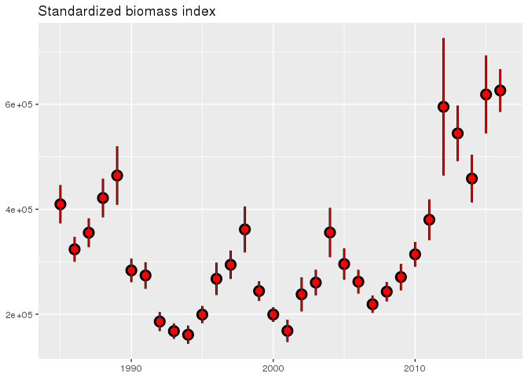

# husky


```r
library(ggplot2)
library(dplyr)
library(fjolst)
library(husky)
```

# Length based SMB indices

__Specs__:

```r
SPECIES <- 1
YEARS <- 1985:2016
KYN <- FALSE # only for the huskyverse
lwcoeff <- LWCOEFF[[as.character(SPECIES)]]
lengdir <- LENGDIR[[as.character(SPECIES)]]
```

NB: The next generation of indices calculation has been seeded in `/net/hafkaldi/export/u2/reikn/Splus5/SurveyWork`. According to Husky (December 2016) this has not "formally" been adopted.

__Script location__: Husky's master scripts is `/net/hafkaldi/export/u2/reikn/Splus5/SMB/allarteg.sh`. This script calls for each species two additional shell scripts:
* `/net/hafkaldi/export/u2/reikn/Splus5/SMB/BIOVISIT_R.sh`
* `/net/hafkaldi/export/u2/reikn/Splus5/SMB/BIOVISIT_R/BIOVISIT_R.sh`

The difference in the two scripts is:
```
 diff BIOVISIT_R.sh BIOVISIT.fastar_R.sh 
10c10,11
< st1 <- STODVAR$y999[STODVAR$y999$tognumer %in% 1:39,]
---
> ind <- c(31931,31932,32131,36731,37031,37131,37132,37231,41431,41531,42231,42232,47431,52331)
> st1 <- STODVAR$y999[STODVAR$y999$tognumer %in% 1:19 | !is.na(match(STODVAR$y999$index,ind)) ,]
129,130c130,131
<     base.visit <- tmp.visit1a
<     aggr.visit <- tmp.visit2a
---
>     base.visit.fastar <- tmp.visit1a
>     aggr.visit.fastar <- tmp.visit2a
133,134c134,135
<   base.visit <- rbind(base.visit,tmp.visit1a)
<   aggr.visit <- rbind(aggr.visit,tmp.visit2a) 
---
>   base.visit.fastar <- rbind(base.visit.fastar,tmp.visit1a)
>   aggr.visit.fastar <- rbind(aggr.visit.fastar,tmp.visit2a) 
145,146c146,147
< aggr.visit$bio <- aggr.visit$fj*lwcoeff[1]*aggr.visit$lengd^lwcoeff[2]/1e3
< base.visit$bio <- base.visit$fj*lwcoeff[1]*base.visit$lengd^lwcoeff[2]/1e3
---
> aggr.visit.fastar$bio <- aggr.visit.fastar$fj*lwcoeff[1]*aggr.visit.fastar$lengd^lwcoeff[2]/1e3
> base.visit.fastar$bio <- base.visit.fastar$fj*lwcoeff[1]*base.visit.fastar$lengd^lwcoeff[2]/1e3
```
__Minimum fuzz adaptation__: The functions and data objects have been moved from the various `.RData` spaces to the `husky`-package. The following is based on the script `/net/hafkaldi/export/u2/reikn/Splus5/SMB/BIOVISIT_R.sh` with some minimum adaptations.


```r
base.visit2 <- list()
aggr.visit2 <- list()
STODVAR2 <- dplyr::bind_rows(STODVAR)  # EH added

for (j in 1:length(YEARS)) {
  #print(YEARS[j])
  #st1 <- STODVAR$'y1985'[STODVAR$'y1985'$tognumer %in% 1:39,]
  st1 <- STODVAR2[STODVAR2$ar == YEARS[j] & STODVAR2$tognumer %in% 1:39,] # EH added
  tmp <- lesa.lengdir(st1$synis.id,SPECIES,col.names="kyn")
  tmp1 <- lesa.numer(st1$synis.id,SPECIES) 
  tmp <- Skala.med.toldum(tmp,tmp1)
  i <- is.na(tmp$fj.alls) 
  tmp$fj.alls[i] <- 0
  tmp$bio <- tmp$fj.alls*lwcoeff[1]*tmp$lengd^lwcoeff[2]/1e6 # tonn
  tmp$fj.alls <- tmp$fj.alls/1e3 # þúsundir
  
  
  for( i in 1:length(lengdir)) {
    
    #print(i) 
    tmp1 <- tmp[tmp$lengd==lengdir[i],]
    
    if(nrow(tmp1) > 0) {
      x <- apply.shrink(tmp1$fj.alls,tmp1$synis.id,sum) 
      names(x) <- c("synis.id","fj")
      st <- husky:::join(st1[,c("newstrata","toglengd","synis.id")],x,"synis.id",set=0)
    } else {
      st <- st1[,c("newstrata","toglengd","synis.id")]
      st$fj <- rep(0,nrow(st)) 
    }
    
    if(KYN) {
      tmp1 <- tmp[tmp$lengd==lengdir[i] & tmp$kyn==1 & !is.na(tmp$kyn),]
      if(nrow(tmp1) > 0) {
        x <- apply.shrink(tmp1$fj.alls,tmp1$synis.id,sum) 
        names(x) <- c("synis.id","fjhaenga")
        st <- husky:::join(st,x,"synis.id",set=0)
      } else {
        st$fjhaenga <- rep(0,nrow(st)) 
      }
      
      tmp1 <- tmp[tmp$lengd==lengdir[i] & tmp$kyn==2 & !is.na(tmp$kyn),]
      if(nrow(tmp1) > 0) {
        x <- apply.shrink(tmp1$fj.alls,tmp1$synis.id,sum) 
        names(x) <- c("synis.id","fjhrygna")
        st <- husky:::join(st,x,"synis.id",set=0)
      }
      else {
        st$fjhrygna <- rep(0,nrow(st)) 
      }
    }
    
    tmp1 <- tmp[tmp$lengd >= lengdir[i],]
    if(nrow(tmp1) > 0) {
      x <- apply.shrink(tmp1$bio,tmp1$synis.id,sum) 
      names(x) <- c("synis.id","bioge") 
      st <- husky:::join(st,x,"synis.id",set=0)
    } else {
      st$bioge <- rep(0,nrow(st)) 
    }
    
    tmp1 <- tmp[tmp$lengd <= lengdir[i],]
    if(nrow(tmp1) > 0) {
      x <- apply.shrink(tmp1$fj.alls,tmp1$synis.id,sum) 
      names(x) <- c("synis.id","fjle")
      st <- husky:::join(st,x,"synis.id",set=0)
    } else {
      st$fjle <- rep(0,nrow(st)) 
    }
    
    
    tmp.visit <- Calc.index(st,"fj")
    
    tmp.biovisit <- Calc.index(st,"bioge")
    tmp.seidavisit <- Calc.index(st,"fjle")
    
    if(KYN) {
      tmp.haengavisit <- Calc.index(st,"fjhaenga")
      tmp.hrygnuvisit <- Calc.index(st,"fjhrygna")
    }
    
    tmp.visit1 <- tmp.visit$result[,c("strata","total","cv")]
    names(tmp.visit1)[2:3] <- c("fj","cv.fj")
    tmp.visit1$bio.staerri <- tmp.biovisit$result[,"total"]
    tmp.visit1$cv.bio.staerri <- tmp.biovisit$result[,"cv"]
    tmp.visit1$fj.minni <- tmp.seidavisit$result[,"total"]
    tmp.visit1$cv.fj.minni <- tmp.seidavisit$result[,"cv"]
    
    if(KYN) {
      tmp.visit1$fj.haenga <- tmp.haengavisit$result[,"total"]
      tmp.visit1$cv.fj.haenga <- tmp.haengavisit$result[,"cv"]
      tmp.visit1$fj.hrygna <- tmp.hrygnuvisit$result[,"total"]
      tmp.visit1$cv.fj.hrygna <- tmp.hrygnuvisit$result[,"cv"]
    }
    
    tmp.visit2 <- tmp.visit$aggr.output[,c("total","cv")]
    names(tmp.visit2) <- c("fj","cv.fj") 
    tmp.visit2$bio.staerri <- tmp.biovisit$aggr.output[,"total"]
    tmp.visit2$cv.bio.staerri <- tmp.biovisit$aggr.output[,"cv"]
    tmp.visit2$fj.minni <- tmp.seidavisit$aggr.output[,"total"]
    tmp.visit2$cv.fj.minni <- tmp.seidavisit$aggr.output[,"cv"]
    
    if(KYN) {
      tmp.visit2$fj.haenga <- tmp.haengavisit$aggr.output[,"total"]
      tmp.visit2$cv.fj.haenga <- tmp.haengavisit$aggr.output[,"cv"]
      tmp.visit2$fj.hrygna <- tmp.hrygnuvisit$aggr.output[,"total"]
      tmp.visit2$cv.fj.hrygna <- tmp.hrygnuvisit$aggr.output[,"cv"]
    }
    
    
    tmp.visit2$svaedi <- dimnames(tmp.visit2)[[1]]
    tmp.visit2$svaedisnr <- 1:nrow(tmp.visit2)
    dimnames(tmp.visit2)[[1]] <- 1:nrow(tmp.visit2)
    tmp.visit1$lengd <- rep(lengdir[i],nrow(tmp.visit1))
    tmp.visit2$lengd <- rep(lengdir[i],nrow(tmp.visit2))
    tmp.visit1$ar <- rep(YEARS[j],nrow(tmp.visit1))
    tmp.visit2$ar <- rep(YEARS[j],nrow(tmp.visit2))
    if(i == 1 ) {
      tmp.visit1a <- tmp.visit1
      tmp.visit2a <- tmp.visit2
    } else {
      tmp.visit1a <- rbind(tmp.visit1a,tmp.visit1)
      tmp.visit2a <- rbind(tmp.visit2a,tmp.visit2)
    }
  }
  base.visit2[[j]] <- tmp.visit1a
  aggr.visit2[[j]] <- tmp.visit2a
} # End year loop

base.visit2 <- dplyr::bind_rows(base.visit2)
aggr.visit2 <- dplyr::bind_rows(aggr.visit2)
# tonn því fjöldi er þegar í 1000 en lengd-þyngdar gefur grömm.  
aggr.visit2$bio <-
  aggr.visit2$fj*lwcoeff[1]*aggr.visit2$lengd^lwcoeff[2]/1e3
base.visit2$bio <-
  base.visit2$fj*lwcoeff[1]*base.visit2$lengd^lwcoeff[2]/1e3
```

__Internal huskyverse comparison__: rough double testing


```r
attach('/net/hafkaldi/export/u2/reikn/Splus5/SMB/TORSKUR/.RData')
```


```r
ggplot() +
  geom_pointrange(data = aggr.visit2 %>% filter(svaedi == "Heild", lengd == min(lengd)),
                  aes(ar, bio.staerri, 
                      ymin = bio.staerri * (1 - cv.bio.staerri),
                      ymax = bio.staerri * (1 + cv.bio.staerri)),
                  lwd = 1,
                  size = 4) +
  geom_pointrange(data = aggr.visit %>% filter(svaedi == "Heild", lengd == min(lengd)),
                  aes(ar, bio.staerri, 
                      ymin = bio.staerri * (1 - cv.bio.staerri),
                      ymax = bio.staerri * (1 + cv.bio.staerri)),
                  colour = "red") +
  labs(x = NULL, y = NULL, title = "Standardized biomass index")
```

<!-- -->

ERGO: The two huskyverse things are the same


```r
detach("file:/net/hafkaldi/export/u2/reikn/Splus5/SMB/TORSKUR/.RData")
```
